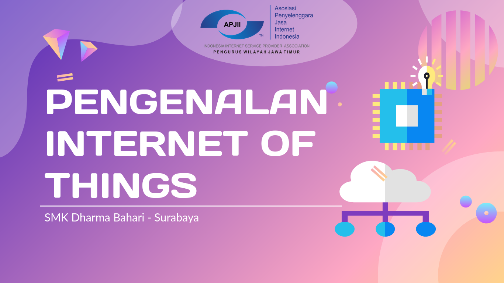
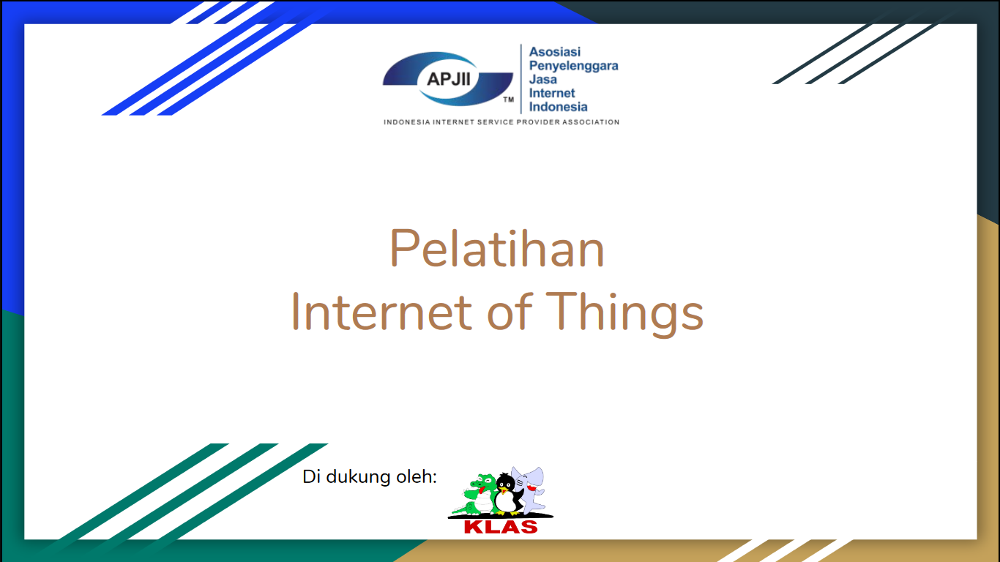

# Pelatihan dan Pengenalan Internet of Things - APJII
Repositori ini menyimpan beberapa berkas yang digunakan dalam pelatihan dan seminar yang dibawakan oleh APJII JATIM.

## Pengenalan Internet of Things - SMK Dharma Bahari - Surabaya
Slide pengenalan Internet of Things pada siswa-siswi SMK Dharma Bahari Surabaya bisa di unduh 
  

## Pelatihan Internet of Things - APJII JATIM
Slide pelatihan Internet of Things bisa di unduh 

